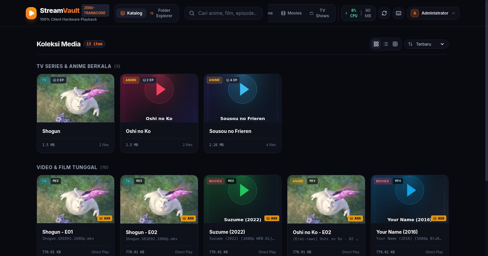
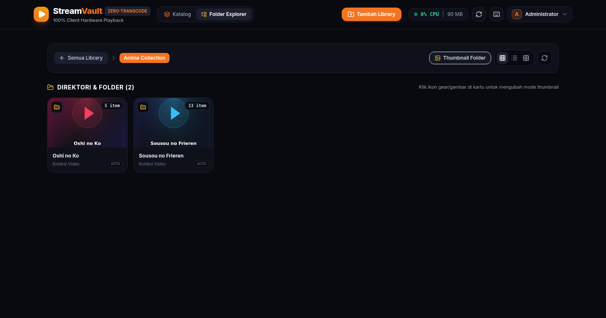
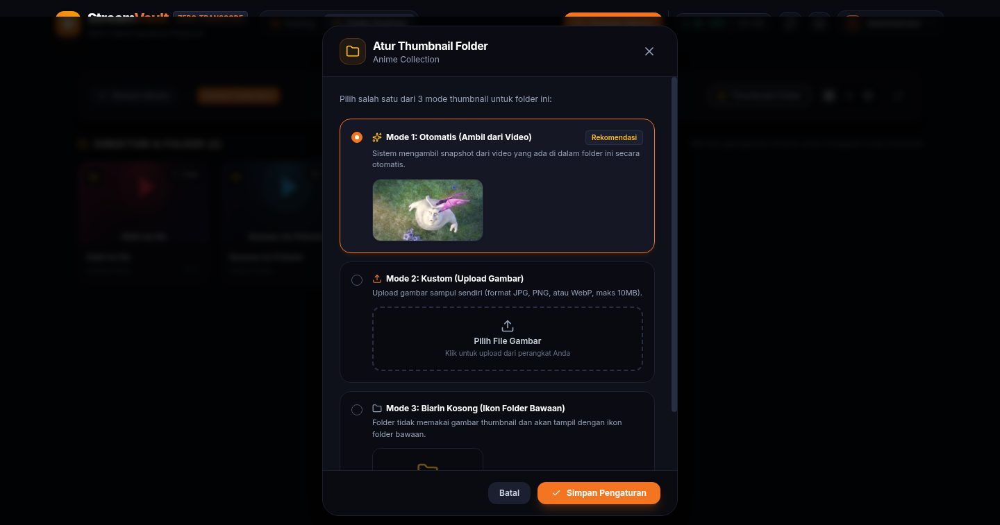
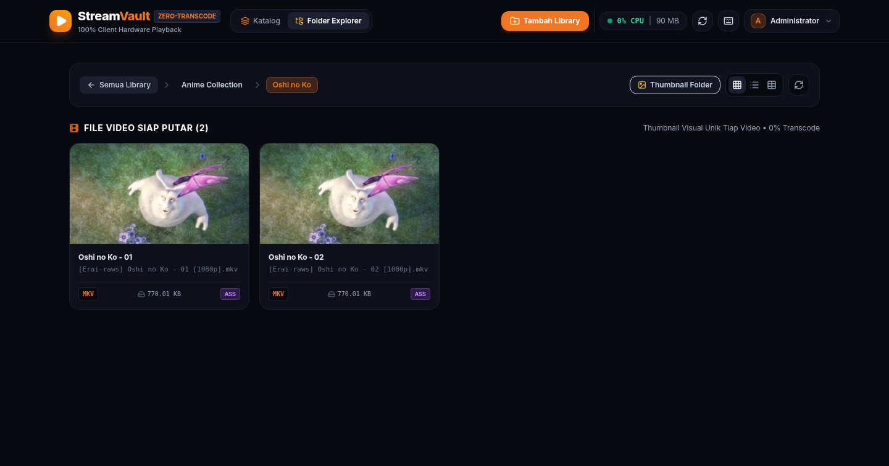
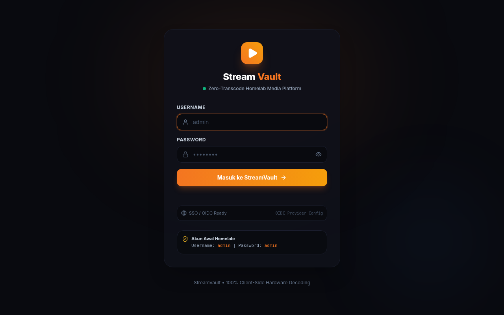
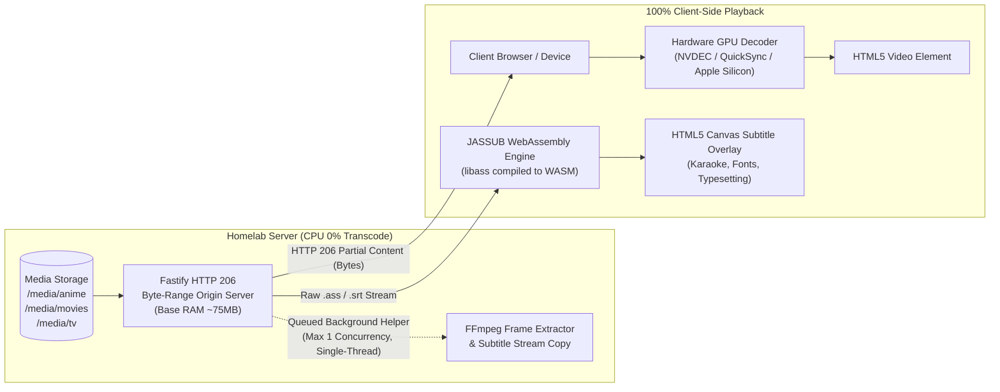

# StreamVault

> "Zero Server-Side Video Transcoding, 100% Client-Side Playback"
>
> A modern self-hosted web streaming platform tailored for personal anime, movie, and TV series collections directly from your homelab storage, without placing video transcoding loads on your server CPU.

---

## Web Interface Preview

### Media Catalog

*Modern dark media catalog featuring continue watching, series grouping, category filters, and live server resource monitoring.*

### Folder Explorer

*Jellyfin and Windows Explorer-style directory browsing with multiple view modes (Grid, Compact, and Details Table).*

### 3-Mode Folder Thumbnail Customizer

*Interactive cover customization supporting three modes: Auto (frame extraction from contained video), Custom (image upload), and None (clean default folder icon).*

### Unique Video Thumbnails & File View

*Fast native video thumbnail generation via FFmpeg with SHA-256 disk caching, badge indicators for ASS subtitles, and direct video streaming.*

### Authentication & Single Sign-On (OIDC Ready)

*Jellyfin and Komga-inspired authentication system with scrypt password hashing, session tokens, and built-in OIDC/SSO integration readiness.*

---

## Core Philosophy and Architecture

Traditional media servers (such as standard Plex or Jellyfin) often trigger FFmpeg server-side transcoding when playing MKV containers or stylized anime subtitles (`.ass`/`.ssa`). This causes:
- Server CPU usage spikes to 100%, causing heat and stuttering on low-power homelab hardware.
- Hardcoded or burned-in subtitles, resulting in lost karaoke typography, blurry text, and dropped frames.
- Slow video seeking due to buffering delay for each new transcode stream segment.

### StreamVault Architecture



1. **Server CPU at 0% for Video Playback**: The backend never transcodes video or audio streams on the fly. The server operates strictly as an RFC 7233 HTTP range origin server.
2. **100% Hardware Acceleration**: The client browser decodes video streams using local hardware decoders (NVIDIA NVDEC, Intel QuickSync, Apple Silicon, VideoToolbox).
3. **Full Anime `.ass` Subtitle Fidelity**: Subtitles are never burned in on the server. StreamVault uses **JASSUB (WebAssembly libass)** to render subtitles directly onto an HTML5 canvas layer at 60 FPS, preserving all custom fonts, karaoke effects, and vector drawings.
4. **Guarded Subprocess Helpers**:
   - For video frame preview snapshots and softsub track extraction, FFmpeg/FFprobe runs as an internal helper strictly controlled by an **asynchronous concurrency queue** (`FFMPEG_MAX_CONCURRENCY=1`), `-threads 1`, hard timeouts (15s), and persistent negative caching to prevent any OOM-kills or CPU spikes.
   - Base Node runtime sits at ~75 MB RAM. The recommended container memory limit is **512 MB** to comfortably support concurrent playback alongside single-worker thumbnail tasks.

---

## Architecture Comparison

| Feature | Standard Plex / Emby | Jellyfin (Burn-in ASS) | StreamVault |
|---|---|---|---|
| Server CPU Load During Playback | 50% - 100% (Transcoding) | 60% - 100% (Burn-in Transcode) | **0.0% (Direct Play Only)** |
| Server Base Memory Usage | 400 MB - 1 GB+ | 300 MB - 800 MB | **~75 MB (512 MB Container Limit)** |
| Subprocess Resource Guard | None | Configurable | **Queue Limiter + Hard 15s Timeout + Circuit Breaker** |
| Anime Subtitle Quality (.ass) | Downscaled or dropped styles | Burned-in, rasterized text | **Native 1080p/4K Canvas (WASM)** |
| Karaoke and Custom Font Effects | Often lost | Limited | **100% Accurate (libass engine)** |
| Video Seeking Speed | High latency (buffer wait) | High latency | **Instant (<50ms via Byte-Range)** |
| Resume Playback Timestamp | Cloud / Database overhead | Local database queries | **Instant LocalStorage sync** |

---

## Key Features

### 1. Guarded Native Video Thumbnail Extraction
- Automated frame extraction directly from video files (MKV, MP4, WebM, AVI, TS) using single-threaded FFmpeg.
- Subtitle and font attachment parsing disabled (`-sn -an -dn`) to eliminate memory bloat when scanning complex MKV files.
- Persistent SHA-256 disk caching (`.cache/thumbnails/`) with negative SVG caching: corrupt or failing files fail fast and never trigger retry loops.
- Asynchronous concurrency limiter ensures container memory stays safely within bounds.

### 2. Three-Mode Folder Thumbnail System
Configure thumbnails for any folder or series through an interactive modal:
- **Auto Mode**: Automatically selects an image or extracts a frame from the first video found within the directory.
- **Custom Mode**: Upload your own image file (JPG, PNG, WebP up to 10 MB) with real-time preview.
- **None Mode**: Displays a clean, default folder icon with no artwork.

### 3. Jellyfin & Komga-Style Authentication
- Secured with scrypt-salted password hashing.
- Stateless HMAC-SHA256 session tokens with 7-day expiration.
- Default administrator credentials provided on initial start (`admin` / `admin`).
- User profile menu with role badges, password change dialog, and logout functionality.

### 4. SSO / OIDC Infrastructure Ready
- Built-in OpenID Connect (OIDC) client infrastructure supporting standard discovery (`/.well-known/openid-configuration`), authorization code flow, PKCE, and automated user provisioning.
- Ready to connect to any custom OIDC Provider, Authelia, Authentik, or Keycloak.

---

## Repository Structure

```text
stream-vault/
├── docker-compose.yml          # Container deployment configuration
├── Dockerfile                  # Multi-stage Node alpine image
├── package.json                # Root scripts and workspace definition
├── README.md                   # Project documentation
│
├── media/                      # Mount folder for homelab media (read-only)
│   ├── anime/                  # Anime series and standalone episodes
│   ├── movies/                 # Feature films and companion artwork
│   └── tv/                     # Television shows and multi-season directories
│
├── server/                     # Fastify Zero-Transcode Backend
│   ├── package.json
│   ├── data/                   # User database and folder thumbnail configs
│   └── src/
│       ├── index.js            # Main application server and routes
│       ├── config.js           # Environment and path configurations
│       ├── processQueue.js     # Asynchronous subprocess concurrency queue
│       ├── thumbnails.js       # Guarded FFmpeg video frame extraction & 3-mode resolver
│       ├── explorer.js         # Hierarchical file and folder explorer
│       ├── scanner.js          # Media library indexer
│       ├── streamer.js         # HTTP 206 Partial Content byte-range engine
│       ├── subtitles.js        # Guarded subtitle extraction and detection
│       └── auth/
│           ├── userStore.js    # scrypt password hashing and user persistence
│           ├── tokenService.js # HMAC session token signing and verification
│           ├── oidcProvider.js # OpenID Connect discovery and callback handler
│           └── authMiddleware.js # Fastify route authentication hook
│
├── client/                     # Single Page Application (React + Vite + Tailwind)
│   ├── package.json
│   ├── vite.config.js
│   ├── public/jassub/          # WebAssembly libass worker and fonts
│   └── src/
│       ├── App.jsx             # Main view router and global state
│       ├── context/
│       │   └── AuthContext.jsx # Authentication state and session persistence
│       ├── components/
│       │   ├── LoginPage.jsx   # Dark authentication card
│       │   ├── Navbar.jsx      # Navigation, search, CPU status, and account menu
│       │   ├── FolderExplorer.jsx # Directory navigation with multi-mode view
│       │   ├── FolderThumbModal.jsx # 3-mode folder thumbnail customizer
│       │   ├── MediaGrid.jsx   # Catalog poster display
│       │   ├── MediaCard.jsx   # Individual media item card
│       │   ├── VideoPlayer.jsx # Artplayer and JASSUB WebAssembly canvas player
│       │   ├── VideoThumbnail.jsx # Native image and client canvas fallback renderer
│       │   └── ChangePasswordModal.jsx # User password update modal
│       └── utils/
│           ├── api.js          # Authenticated API client
│           └── storage.js      # LocalStorage manager for watch progress
│
└── docs/
    ├── services.md             # Homelab operational and deployment registry
    └── screenshots/            # Documentation images
```

---

## Quick Start Guide

### Option 1: Docker Deployment (Recommended)

1. Set up your media directory and start the container:

```bash
cd /root/stream-vault

# Start container in detached mode
docker compose up -d --build
```

2. Access the web interface at `http://localhost:8090` (or `http://<your-server-ip>:8090`).
3. Log in with the default credentials:
   - **Username**: `admin`
   - **Password**: `admin`

#### Mounting Your Homelab Hard Drives in `docker-compose.yml`

```yaml
services:
  stream-vault:
    build: .
    container_name: stream-vault
    restart: unless-stopped
    ports:
      - "8090:8090"
    environment:
      - MEDIA_ROOT=/media
      - PORT=8090
      - AUTH_ENABLED=true
      - FFMPEG_MAX_CONCURRENCY=1
    volumes:
      # Replace with your actual media storage mount path:
      - /mnt/storage/media:/media:ro
      - stream-vault-cache:/app/.cache
      - stream-vault-data:/app/data
    deploy:
      resources:
        limits:
          memory: 512M
        reservations:
          memory: 128M
```

> **Security Note**: The `:ro` (Read-Only) flag ensures that StreamVault cannot alter or delete files on your media drives.

---

### Option 2: Running Without Docker (Direct Node.js)

#### Prerequisites
- Node.js v18+ or v20+
- FFmpeg (for automated server-side video thumbnail frame extraction)

#### Installation and Startup

```bash
# 1. Install all dependencies
npm run install:all

# 2. Build the client application
npm run build:client

# 3. Start the server
npm start
```

For development mode with hot-reloading:
```bash
# Terminal 1: Backend Fastify server
npm run server:dev

# Terminal 2: Frontend Vite development server
npm run client:dev
```

---

## Single Sign-On (OIDC) Configuration

To connect StreamVault with your OpenID Connect provider, set the following environment variables in `.env` or in your container environment:

```bash
OIDC_ENABLED=true
OIDC_ISSUER_URL=https://sso.yourdomain.com
OIDC_CLIENT_ID=streamvault
OIDC_CLIENT_SECRET=your_client_secret
OIDC_REDIRECT_URI=http://localhost:8090/api/auth/oidc/callback
```

When enabled, a "Sign in with Single Sign-On (OIDC)" button appears automatically on the login screen.

---

## Video Player Keyboard Shortcuts

| Shortcut | Action |
|---|---|
| Space | Play / Pause video |
| J | Seek backward 10 seconds |
| L | Seek forward 10 seconds |
| Left Arrow | Seek backward 5 seconds |
| Right Arrow | Seek forward 5 seconds |
| Up Arrow / Down Arrow | Increase / decrease volume by 10% |
| M | Mute / Unmute audio |
| F | Toggle fullscreen |
| C | Open subtitle selection menu |
| N | Skip to next episode |
| P | Return to previous episode |

---

## REST API Reference

| Method | Endpoint | Description |
|---|---|---|
| `GET` | `/api/health` | Server health, memory metrics, queue stats, and uptime |
| `POST`| `/api/auth/login` | Authenticate with username and password, returns session token |
| `GET` | `/api/auth/me` | Retrieve authenticated user profile and permissions |
| `POST`| `/api/auth/change-password` | Update user password |
| `GET` | `/api/auth/providers` | Query available authentication providers (Local and OIDC) |
| `GET` | `/api/media` | Retrieve complete indexed media catalog |
| `POST`| `/api/media/scan` | Trigger background media directory rescan |
| `GET` | `/api/browse?subpath=...` | Browse folders and files with metadata and thumbnails |
| `GET` | `/api/thumbnail?path=...` | Get or generate native video frame thumbnail (guarded queue) |
| `GET` | `/api/folders/config?subpath=...` | Get 3-mode thumbnail configuration for a folder |
| `POST`| `/api/folders/thumbnail` | Update folder thumbnail mode (`auto`, `custom`, `none`) or upload cover |
| `GET` | `/api/folders/thumbnail/image?folder=...` | Serve custom uploaded folder thumbnail |
| `GET` | `/api/stream?path=...` | Stream video content via HTTP 206 Partial Content (Byte Ranges) |
| `GET` | `/api/subtitles?path=...` | Serve companion subtitle tracks (`.ass`, `.srt`, `.vtt`) |
| `GET` | `/api/subtitles/extract?path=...` | Extract embedded subtitle track on-demand via raw stream copy |
| `GET` | `/api/poster?path=...` | Serve companion poster image |

---

## License

Distributed under the MIT License. Feel free to use and modify it for your self-hosted homelab environment.
