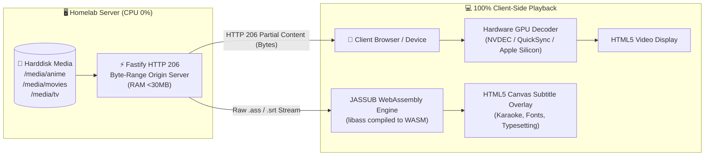

# ⚡ StreamVault (`stream-vault`)

> **"Zero Server-Side Transcode, 100% Client-Side Playback"**  
> Modern self-hosted web video streaming platform ala YouTube & Crunchyroll, dirancang khusus untuk memutar koleksi anime, movie, dan serial TV pribadi dari harddisk homelab Anda tanpa membebani CPU server.

---

## 🎯 Filosofi & Arsitektur Utama

Banyak media server tradisional (seperti Plex atau Jellyfin standar) menyalakan transcode FFmpeg di server setiap kali memutar video MKV atau subtitle anime bergaya `.ass`. Akibatnya:
- CPU server langsung melonjak 100% (server homelab kepanasan/lag).
- Kualitas subtitle typesetting & karaoke anime rusak atau ter-burn-in secara kasar.
- Seeking video lambat karena harus menunggu buffer transcode baru.

### Solusi StreamVault:


1. **Server CPU 0%**: Backend TIDAK PERNAH melakukan transcoding video/audio on-the-fly. Server murni bertindak sebagai origin HTTP range server (byte-range streaming RFC 7233).
2. **100% Hardware Acceleration di Client**: Browser dan perangkat penonton mendecode stream H.264, HEVC, AV1 menggunakan GPU lokal (NVIDIA NVDEC, Intel QuickSync, Apple Silicon, VideoToolbox).
3. **Dukungan Penuh Subtitle Anime `.ass`**: Subtitle `.ass` TIDAK di-burn-in di server. Menggunakan **JASSUB (WebAssembly libass)** yang me-render subtitle langsung di HTML5 canvas browser dengan dukungan efek karaoke, custom styling, dan font typeset 60 FPS.
4. **Memory Footprint Super Ringan**: Konsumsi RAM backend hanya **~20MB - 30MB**, siap jalan di Raspberry Pi, mini PC N100, NAS lama, atau VPS 512MB RAM.

---

## 📊 Perbandingan Arsitektur

| Fitur | Plex / Emby Standar | Jellyfin (Burn-in ASS) | **StreamVault** |
|---|---|---|---|
| **Beban CPU Server saat Playback** | 50% - 100% (High Transcode) | 60% - 100% (Burn-in Load) | **0.0% (Zero Transcode)** |
| **Konsumsi RAM Server** | 400MB - 1GB+ | 300MB - 800MB | **< 30 MB** |
| **Kualitas Subtitle Anime (.ass)** | Sering downscale / text drop | Text kasar (di-burn ke video) | **Native 1080p/4K Canvas (WASM)** |
| **Efek Karaoke & Font Anime** | Sering hilang | Terbatas | **100% Akurat (libass engine)** |
| **Kecepatan Seeking Video** | Lambat (nunggu transcode baru) | Lambat | **Instan (<50ms via Byte-Range)** |
| **Resume Playback (Timestamp)** | Cloud DB | Database lokal | **Instant LocalStorage Cache** |

---

## 🗂️ Struktur Folder Project

```text
stream-vault/
├── docker-compose.yml          # Konfigurasi Docker compose siap deploy
├── Dockerfile                  # Multi-stage build Node alpine (<90MB image)
├── .dockerignore
├── package.json                # Root scripts shortcut
├── README.md                   # Dokumentasi lengkap
│
├── media/                      # Mount folder media (read-only)
│   ├── anime/                  # Koleksi Anime (bisa folder series atau file langsung)
│   │   └── Sousou no Frieren/
│   │       ├── [SubsPlease] Sousou no Frieren - 01 (1080p).mkv
│   │       ├── [SubsPlease] Sousou no Frieren - 01 (1080p).id.ass
│   │       └── [SubsPlease] Sousou no Frieren - 01 (1080p).en.ass
│   ├── movies/                 # Koleksi Film Layar Lebar
│   │   ├── Your Name (2016) [1080p].mp4
│   │   └── Your Name (2016) [1080p].id.ass
│   └── tv/                     # Serial Drama / TV Shows
│       └── Shogun/
│           └── Season 1/
│               ├── Shogun.S01E01.1080p.mkv
│               └── Shogun.S01E01.1080p.id.ass
│
├── server/                     # Backend Fastify Zero-Transcode
│   ├── package.json
│   └── src/
│       ├── index.js            # Entry point & API routes
│       ├── config.js           # Konfigurasi port, path, format media
│       ├── scanner.js          # Parser direktori cerdas (Anime, TV, Movies)
│       ├── streamer.js         # HTTP 206 Partial Content range streaming engine
│       └── subtitles.js        # Deteksi companion subtitle & language parser
│
├── client/                     # Frontend Single Page Application
│   ├── package.json
│   ├── vite.config.js          # Vite config dengan Worker ES support
│   ├── tailwind.config.js      # Dark theme styling ala YouTube/Crunchyroll
│   ├── public/jassub/          # WebAssembly libass worker & default fonts
│   └── src/
│       ├── App.jsx             # State management & library views
│       ├── components/
│       │   ├── Navbar.jsx      # Header, search, filter kategori, live CPU pill
│       │   ├── VideoPlayer.jsx # Artplayer + JASSUB canvas integration
│       │   ├── MediaGrid.jsx   # Grid poster anime/movie dengan filter
│       │   ├── MediaCard.jsx   # Komponen kartu poster + badge ASS
│       │   ├── SeriesModal.jsx # Episode list drawer untuk anime & TV
│       │   ├── ContinueWatching.jsx # Resume playback bar
│       │   ├── StatsModal.jsx  # Monitor status arsitektur & RAM server
│       │   └── KeyboardShortcutsModal.jsx # Panduan hotkey player
│       └── utils/
│           ├── api.js          # REST client
│           ├── storage.js      # LocalStorage manager untuk resume timestamp
│           └── formatters.js   # Format ukuran file & durasi
│
└── scripts/
    └── setup-sample-media.js   # Generator sampel media & subtitle ASS untuk demo
```

---

## 🚀 Panduan Quick Start (Docker Deployment)

### 1. Clone & Siapkan Mount Media
Hubungkan folder media homelab Anda ke folder `./media` atau atur volume binding di `docker-compose.yml`:

```bash
cd /root/stream-vault

# (Opsional) Buat sampel media untuk uji coba langsung
npm run setup:samples
```

### 2. Jalankan dengan Docker Compose
```bash
docker compose up -d --build
```

Container akan otomatis berjalan di port **8090**:
- Buka browser di: `http://localhost:8090` atau `http://<ip-server-homelab>:8090`

### 3. Konfigurasi `docker-compose.yml` untuk Homelab Harddisk
Jika Anda memiliki harddisk eksternal atau partisi NFS/ZFS, cukup arahkan path host ke volume `/media:ro`:

```yaml
services:
  stream-vault:
    build: .
    container_name: stream-vault
    restart: unless-stopped
    ports:
      - "8090:8090"
    environment:
      - MEDIA_ROOT=/media
      - PORT=8090
    volumes:
      # Ganti '/mnt/storage/media' dengan path harddisk asli Anda:
      - /mnt/storage/media:/media:ro
      - stream-vault-cache:/app/.cache
```

> **Catatan Keamanan**: Flag `:ro` (Read-Only) memastikan server StreamVault tidak akan pernah memodifikasi atau menghapus koleksi media berharga di harddisk Anda.

---

## 🛠️ Menjalankan Tanpa Docker (Mode Development Lokal)

### Prasyarat
- Node.js v18+ atau v20+ / v22+
- npm

```bash
# 1. Install dependencies server & client
npm run install:all

# 2. Siapkan sampel media jika belum ada
npm run setup:samples

# 3. Build frontend ke production bundle
npm run build:client

# 4. Jalankan backend server
npm start
```
Akses di browser: `http://localhost:8090`

Untuk mode development dengan auto-reload:
```bash
# Terminal 1 (Backend Fastify)
npm run server:dev

# Terminal 2 (Frontend Vite HMR)
npm run client:dev
```

---

## 🎮 Shortcut Keyboard Video Player

Player StreamVault dilengkapi pintasan keyboard penuh ala YouTube & MPV:

| Tombol | Aksi |
|---|---|
| <kbd>Space</kbd> | Play / Pause video |
| <kbd>J</kbd> | Mundur 10 detik |
| <kbd>L</kbd> | Maju 10 detik |
| <kbd>←</kbd> (Panah Kiri) | Mundur 5 detik |
| <kbd>→</kbd> (Panah Kanan) | Maju 5 detik |
| <kbd>↑</kbd> / <kbd>↓</kbd> | Naik / turun volume 10% |
| <kbd>M</kbd> | Mute / Unmute suara |
| <kbd>F</kbd> | Masuk / keluar layar penuh (Fullscreen) |
| <kbd>C</kbd> | Buka menu pemilihan Subtitle |
| <kbd>N</kbd> | Lanjut ke episode berikutnya (Next Episode) |
| <kbd>P</kbd> | Kembali ke episode sebelumnya (Previous Episode) |

---

## 🎨 Format Penamaan File yang Didukung

StreamVault secara otomatis mengenali nama rilis anime umum, release group, episode, serta file subtitle pendamping:

- **Folder Anime**:
  - `anime/Sousou no Frieren/[SubsPlease] Sousou no Frieren - 01 (1080p).mkv`
  - `anime/Sousou no Frieren/[SubsPlease] Sousou no Frieren - 01 (1080p).id.ass` *(Subtitle Bahasa Indonesia)*
  - `anime/Sousou no Frieren/[SubsPlease] Sousou no Frieren - 01 (1080p).en.ass` *(Subtitle Bahasa Inggris)*
- **Folder Movie**:
  - `movies/Your Name (2016)/Your Name (2016).mp4`
  - `movies/Your Name (2016)/Your Name (2016).id.ass`
  - `movies/Your Name (2016)/poster.jpg` *(Thumbnail otomatis)*
- **Folder TV Shows**:
  - `tv/Shogun/Season 1/Shogun S01E01.1080p.mkv`
  - `tv/Shogun/Season 1/Shogun S01E01.1080p.id.ass`

### Deteksi Bahasa Subtitle Otomatis:
Jika nama subtitle mengandung `.id.ass`, `.ind.ass`, atau `[Indo]`, sistem akan menampilkannya sebagai **Indonesian (ASS)**. Kode `.en.ass`, `.ja.ass`, `.es.ass`, dsb. juga dikenali secara otomatis.

Selain itu, jika file video tidak memiliki subtitle bawaan, Anda dapat langsung mengunggah file `.ass` / `.srt` dari komputer Anda menggunakan tombol **"Load Local Subtitle File"** langsung di pemutar video.

---

## 📡 Dokumentasi Endpoint REST API

| Method | Endpoint | Deskripsi |
|---|---|---|
| `GET` | `/api/health` | Status server, penggunaan RAM, uptime, dan indikator CPU 0% |
| `GET` | `/api/media` | Mengambil seluruh katalog media yang sudah terindeks |
| `POST`| `/api/media/scan` | Memaksa scan ulang direktori media |
| `GET` | `/api/stream?path=...` | Streaming video via HTTP 206 Partial Content (Range bytes) |
| `GET` | `/api/subtitles?path=...` | Mengirim file subtitle (`text/x-ssa` untuk ASS, `text/vtt`, etc.) |
| `GET` | `/api/poster?path=...` | Mengirim gambar poster/thumbnail |

---

## 📄 Lisensi
Didistribusikan di bawah lisensi MIT. Silakan gunakan dan sesuaikan untuk kebutuhan server homelab Anda!
